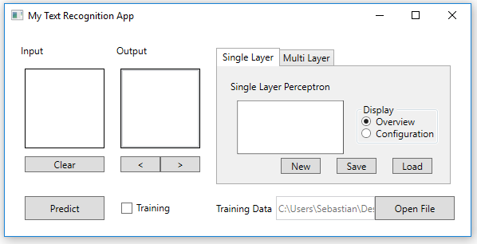

# Deeplearning a beginner's attempt.

As part of my study work for the module AI, i've tried to implement a Single Layer Perceptron (SLP).

Q: Why didn't I use an existing library?  
A: I love the pain to start from scratch!

## Getting Started

### Prerequisites

Things to compile and run this project. Experts might know better.

```
Windows Device
Visual Studio
Git
```

### Installing

Open your Git client of choice and navigate to desired location.

```
WIN + R
type 'cmd' and run
type cd pathToDesiredLocation
```

Clone the project

```
git clone https://github.com/xyleninja/DeepLearning.git
```

Wait for Git to download the project and open the new directory. Open the DeepLearning.sln  
file with Visual Studio and build the Project.

```
Build > Build Solution | CTRL + SHIFT + B
```

### Run the Project

Navigate to the build folder. And double click the 'MyTextRecognition.exe'. 

We can see now this StartUp Screen.



Since our Single Layer Perceptron didn't learn anything yet, we have to train it.  
Check the 'Training'-Checkbox and use the Left MouseButton to draw on the input canvas,  
Right MouseButton removes the pixel. You can also use the Clear Button to remove everything.  
With the two Buttons below the Output TextBox, you can select the Character which should be  
trained. Leftclick on the TextBox and you can type the char directly. **Note:** only numbers work.  


Uncheck the checkbox and draw on the input canvas again. When you are done hit the Predict Button  
to let the neural network classify your input.


When you close the application without crashing it. It will save the the Training Data and SLP in  
the same directory as the .exe as 'defaultTrainData' and 'defaultSLP' respectively.

There's a trick to apply the Training Data to a new SLP, since I haven't implemented it yet, we have  
to delete the 'defaultSLP' file. Doing so will create a new one which gets trained with the Training  
Data on start of the Application.

## Additional Notes
It works just fine for less characters. I tried to train the SLP with 5 samples for each character,  
but it predicts often something else. This might be a disadvantage of the SLP. However it might just  
be my bad luck and the lack of samples.

Here are some other infos:  
Input Size: 16 * 16  
Learning Rate: 0.1  
Allowed Chars: "0123456789"  
TrainingDataFormat: **"[0|1]{256} [0|1]{10}"** with 256=input size and 10=alphabet size.  
OneHotEncoding  
## Authors

* **Sebastian Strubert** - Development & Documentation - [xyleninja](https://github.com/xyleninja)

## License

This project is licensed under the MIT License - see the [LICENSE.md](LICENSE.md) file for details